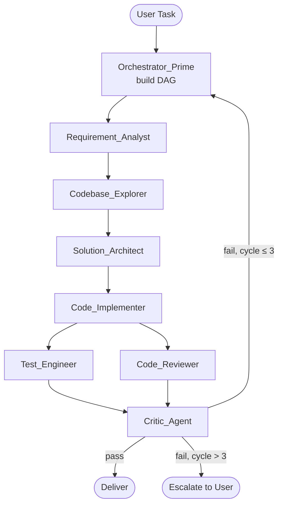

# ai-skills

A collection of reusable [OpenCode](https://opencode.ai) skills and global rules for AI-assisted development.

## Repository Structure

```
ai-skills/
├── AGENTS.md                         ← global OpenCode rules (copy to ~/.config/opencode/)
└── skills/
    ├── coding-standards/SKILL.md     ← coding style, testing, and comment guidelines
    └── agent-orchestration/SKILL.md  ← multi-agent DAG orchestration system
```

## AGENTS.md

[`AGENTS.md`](AGENTS.md) is the global rules file read by OpenCode at the start of every session. It controls which skills are loaded by default and when. Copy it to your OpenCode global config directory:

```
~/.config/opencode/AGENTS.md   # macOS / Linux
%APPDATA%\opencode\AGENTS.md   # Windows
```

## What are skills?

Skills are `SKILL.md` files loaded into an OpenCode session to provide domain-specific context, rules, and workflows. They keep the AI focused and consistent across sessions.

## Skills

| Skill | Description |
|---|---|
| [`coding-standards`](skills/coding-standards/SKILL.md) | Coding style, testing, and comment guidelines for clean, minimal, production-quality code |
| [`agent-orchestration`](skills/agent-orchestration/SKILL.md) | Multi-agent DAG orchestration system with specialist roles for software development tasks |

## Agent Orchestration — DAG Overview



Each node is an independent specialist agent. All data flows through a shared Global State object — agents never call each other directly.

## Usage

### Install skills globally

Clone this repo into your OpenCode global skills directory:

```bash
# macOS / Linux
git clone https://github.com/Cristian-Oancea01/ai-skills.git ~/.config/opencode/skills

# Windows
git clone https://github.com/Cristian-Oancea01/ai-skills.git %APPDATA%\opencode\skills
```

OpenCode will automatically discover all skills in `skills/*/SKILL.md`.

### Load a skill manually

```
/skill coding-standards
```

### Reference skills from AGENTS.md

```md
- `coding-standards` — always load for any coding task
- `agent-orchestration` — load for complex multi-step tasks
```

### Project-local skills

To scope a skill to a specific project, place it in `.opencode/skills/<name>/SKILL.md` within that project's repo instead of the global skills directory.

## Conventions

- Each skill lives in `skills/<name>/SKILL.md`
- Skills are kept as short as possible — high signal, no filler
- Update skills after every session that produces new discoveries or lessons learned
- Commit skill updates in a dedicated commit: `<skill-name>: <what was learned/fixed>`
