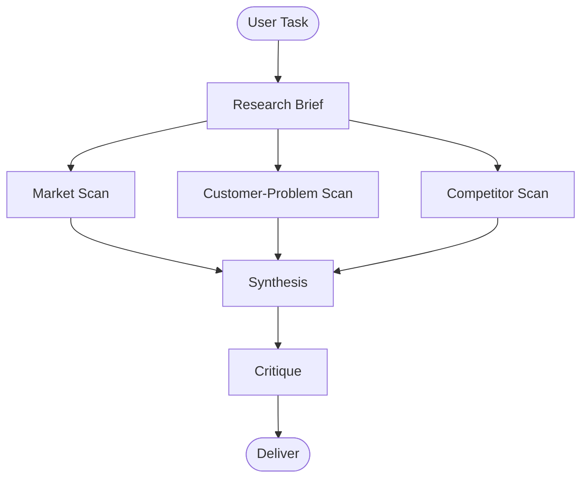
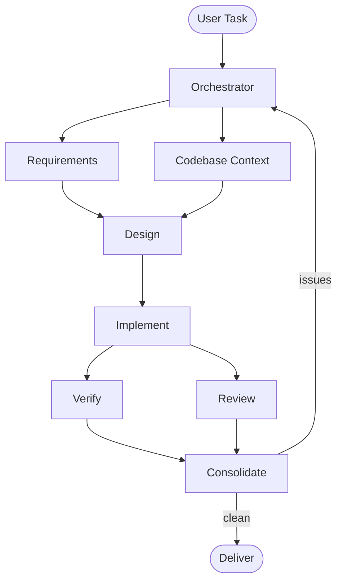

# ai-skills

A collection of reusable [OpenCode](https://opencode.ai) skills and global rules for AI-assisted development.

## Repository Structure

```
ai-skills/
├── AGENTS.md
└── skills/
    ├── agent-orchestration/SKILL.md             ← medium orchestration for larger work
    ├── always-plan/SKILL.md              ← planning-first rule before implementation
    ├── coding-standards/SKILL.md         ← coding style, testing, and comment guidelines
    ├── coverage-increase/SKILL.md        ← coverage improvement workflow
    ├── enterprise-agent-orchestration/SKILL.md ← large enterprise orchestration
    ├── frontend-ui-guide/SKILL.md        ← reuse-first frontend UI guidance
    ├── implementation-review/SKILL.md    ← findings-first implementation review
    ├── orchestration-router/SKILL.md     ← decides whether to orchestrate and which mode
    ├── project-bootstrap/SKILL.md        ← AGENTS.md-first project workflow
    ├── research-agent/
    │   ├── SKILL.md                      ← evidence-first market and opportunity research
    │   ├── examples/example-opportunity-report.md
    │   └── templates/
    │       ├── opportunity-report.md
    │       ├── research-brief.md
    │       └── source-log.md
    └── small-task-orchestration/SKILL.md ← lightweight orchestration for small tasks
```

## What are skills?

Skills are `SKILL.md` files loaded into an OpenCode session to provide domain-specific context, rules, and workflows. They keep the AI focused and consistent across sessions.

## Skills

| Skill | Description |
|---|---|
| [`always-plan`](skills/always-plan/SKILL.md) | Mandatory planning rule that requires a short implementation plan before non-trivial work |
| [`orchestration-router`](skills/orchestration-router/SKILL.md) | Mandatory routing skill that decides whether to use no orchestration, small, medium, or enterprise orchestration |
| [`small-task-orchestration`](skills/small-task-orchestration/SKILL.md) | Lightweight orchestration for small tasks, scripts, and straightforward code changes |
| [`coding-standards`](skills/coding-standards/SKILL.md) | Coding style, testing, and comment guidelines for clean, minimal, production-quality code |
| [`coverage-increase`](skills/coverage-increase/SKILL.md) | Structured workflow for raising test coverage with minimal-risk, convention-matching tests |
| [`agent-orchestration`](skills/agent-orchestration/SKILL.md) | Medium orchestration for larger software tasks that need separate design, implementation, verification, and review stages |
| [`enterprise-agent-orchestration`](skills/enterprise-agent-orchestration/SKILL.md) | Heavyweight orchestration for enterprise-scale projects with explicit roles, state ownership, and remediation cycles |
| [`frontend-ui-guide`](skills/frontend-ui-guide/SKILL.md) | Reuse-first guide for frontend components, layout patterns, and basic accessibility checks |
| [`implementation-review`](skills/implementation-review/SKILL.md) | Findings-first review workflow for completed implementations, focused on bugs and regressions |
| [`project-bootstrap`](skills/project-bootstrap/SKILL.md) | Require `AGENTS.md` lookup first for project work |
| [`research-agent`](skills/research-agent/SKILL.md) | Evidence-first workflow for market scans, competitor review, and decision-ready research docs |

## Research Workflow



Use `research-agent` when the task is about choosing a market, validating a business idea, comparing competitors, or producing structured research documentation.

## Orchestration Tiers

- Small: `small-task-orchestration`
- Medium: `agent-orchestration`
- Large: `enterprise-agent-orchestration`

## Medium Orchestration — DAG Overview



Use the medium path for larger day-to-day work. Use the enterprise path when you want stronger role boundaries and stricter orchestration.

## Usage

### Install skills globally

Clone this repo into your OpenCode global skills directory:

```bash
# macOS / Linux
git clone https://github.com/Cristian-Oancea01/ai-skills.git ~/.config/opencode/skills

# Windows
git clone https://github.com/Cristian-Oancea01/ai-skills.git %APPDATA%\opencode\skills
```

OpenCode will automatically discover all skills in `skills/*/SKILL.md`.

### Load a skill manually

```
/skill coding-standards
```

### Reference skills from AGENTS.md

```md
- `always-plan` — always load before non-trivial implementation work
- `orchestration-router` — mandatory before any orchestration choice
- `small-task-orchestration` — load for small tasks and scripts
- `coding-standards` — always load for any coding task
- `agent-orchestration` — load for medium multi-step tasks
- `enterprise-agent-orchestration` — load for enterprise-scale or highly structured tasks
```

### Project-local skills

To scope a skill to a specific project, place it in `.opencode/skills/<name>/SKILL.md` within that project's repo instead of the global skills directory.

## Conventions

- Each skill lives in `skills/<name>/SKILL.md`
- Skills are kept as short as possible — high signal, no filler
- Update skills after every session that produces new discoveries or lessons learned
- Commit skill updates in a dedicated commit: `<skill-name>: <what was learned/fixed>`
