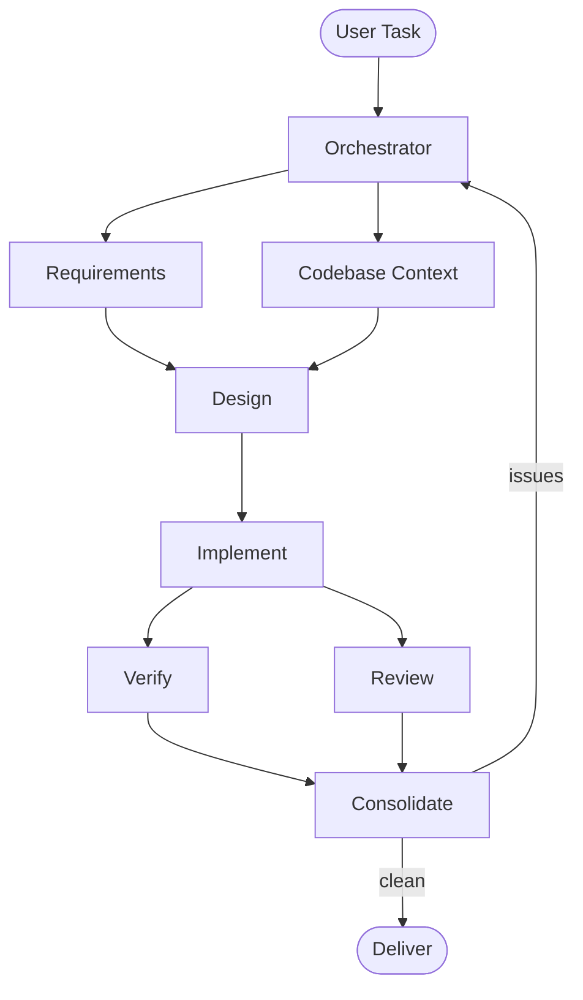

## When to use

Use this skill when the task is too large or risky for `small-task-orchestration`.

Good fits:
- multi-file features or refactors
- work that needs explicit design before coding
- changes that should separate implementation from verification
- tasks with parallelizable subproblems
- work likely to need a remediation loop after review or test failures

Do not use this skill for:
- one-file edits
- small scripts
- straightforward bug fixes
- simple config changes with an obvious path

Use `orchestration-router` first if unsure.

## Graph

## Stage responsibilities

### 1. Orchestrator
- decide whether full orchestration is justified
- build the DAG
- keep tasks small and dependency-aware
- re-route when a stage fails or reveals new work

### 2. Requirements
- extract the actual user intent
- identify constraints and acceptance criteria
- ask questions only when ambiguity blocks safe progress

### 3. Codebase Context
- gather only the project context needed for the task
- identify relevant files, conventions, and risks

### 4. Design
- define the intended change before coding
- map requirements to file changes
- keep the design minimal and implementation-oriented

### 5. Implement
- make the smallest correct changes
- stay within the design unless the design is proven wrong

### 6. Verify
- run the most relevant checks for the task
- prefer targeted tests first, broader validation if needed

### 7. Review
- look for correctness issues, regressions, missing tests, and scope creep
- findings matter more than summaries

### 8. Consolidate
- merge verification and review results
- decide whether to deliver or open a remediation loop

## Orchestration rules

- Do not load this skill together with `small-task-orchestration`.
- Keep the DAG as small as possible.
- Parallelize only independent stages.
- If the task becomes simple after exploration, downgrade to `small-task-orchestration`.
- If a blocker is external, stop and surface the exact blocker.

## Remediation loop

When verify or review fails:
- create only the follow-up tasks needed to address the failure
- rerun only the affected downstream stages
- avoid restarting the whole graph unless the design changed materially

Maximum remediation cycles: 3.

If still failing after that, escalate to the user with:
- what was attempted
- what remains blocked
- the smallest next decision needed

## Output expectations

The final delivery should include:
- what changed
- how it was verified
- any remaining risks or follow-ups

## Skill maintenance

When a session reveals a durable orchestration lesson, update the relevant skill in a dedicated commit.
