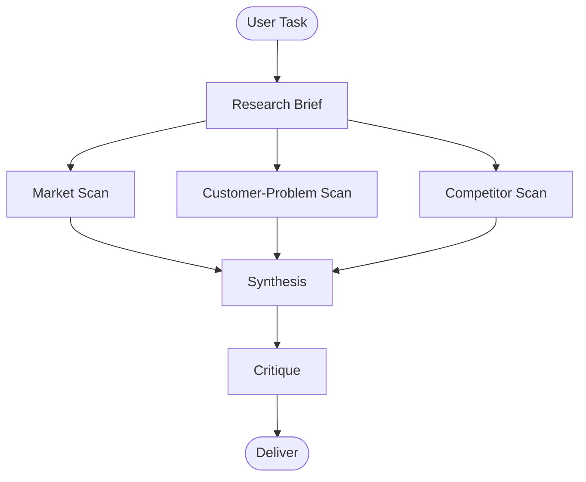

## When to use

Use this skill for:
- market scans
- business idea research
- opportunity discovery
- competitor review
- customer-problem signal gathering
- thesis validation with public sources

Do not use this skill for:
- private-environment discovery
- legal or compliance advice
- deep technical implementation work
- pure coding tasks

## Core outcome

Produce decision-ready research that:
- separates fact from inference
- logs sources clearly
- ranks opportunities instead of listing them loosely
- states uncertainty and open questions explicitly

## Minimal graph

## Stages

### 1. Research Brief
- define the question to answer
- define scope and exclusions
- define target customer and geography if relevant
- define what a useful output looks like

### 2. Market Scan
- collect public evidence of demand, tool adoption, category formation, or workflow pain
- prefer public sources with visible recency

### 3. Customer-Problem Scan
- look for direct user pain, repeated complaints, budget sensitivity, and operational friction
- prefer first-person reports over polished marketing claims

### 4. Competitor Scan
- identify substitutes, direct competitors, and adjacent approaches
- capture how the market is framed, priced, and differentiated

### 5. Synthesis
- score or rank the best opportunities
- explain why the recommendation wins over alternatives
- keep the recommendation narrow and actionable

### 6. Critique
- look for weak evidence
- note blocked or missing sources
- state what would disconfirm the conclusion

## Evidence rules

- Separate facts, inference, and opinion.
- Date claims when recency matters.
- Log sources for every major conclusion.
- Prefer public, accessible sources.
- If key sources are blocked, say so clearly.
- Do not imply precise market size without reliable evidence.

## Output contract

Every deliverable should include:
- objective
- recommendation
- why it wins over alternatives
- target customer
- risks
- open questions
- source log

## Templates

- `templates/research-brief.md`
- `templates/opportunity-report.md`
- `templates/source-log.md`
- `examples/example-opportunity-report.md`

## Rule of thumb

- Evidence first.
- Recommendation second.
- Hype never.
