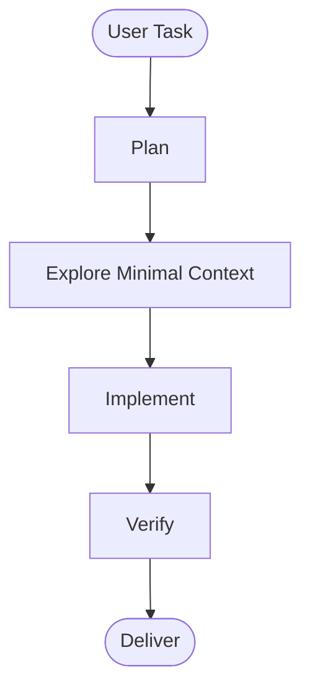

## When to use

Use this skill for:
- small scripts
- one or two file changes
- narrow bug fixes
- straightforward automation tasks
- config edits with a clear path

Do not use this skill when the task needs a full design phase, multiple independent workstreams, or a remediation loop. Use `agent-orchestration` instead.

## Flow

## Stages

### 1. Plan
- restate the task briefly
- name likely files or surfaces
- name the verification step

### 2. Explore Minimal Context
- read only the files needed to implement safely
- avoid broad exploration

### 3. Implement
- make the smallest correct change
- avoid adding abstractions unless required

### 4. Verify
- run the smallest meaningful verification
- prefer targeted tests, lint, build, or command validation

## Rule of thumb

- One path, one implementer, one verification pass.
- No specialist graph unless the task expands during execution.
- If the task grows materially, stop and switch to `agent-orchestration`.
